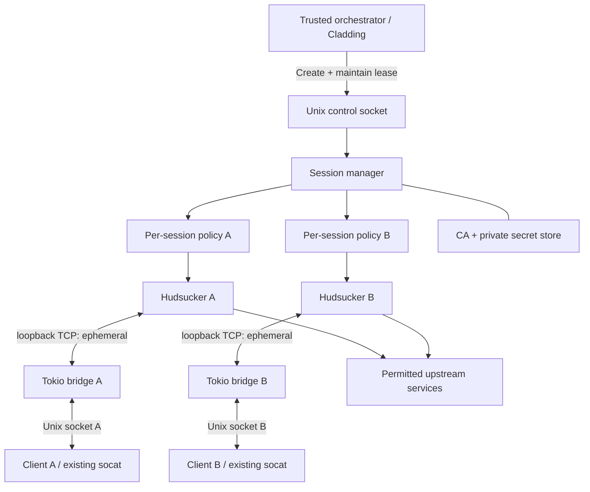

# Baffle: Ephemeral policy-driven HTTP/HTTPS proxy daemon

**Status:** Proposed feature specification, v0.1  
**Project:** New standalone Rust repository, independent of Cladding  
**Executable:** `baffle`  
**Suggested Cargo package:** `baffle-proxy` (`baffle` already exists on crates.io)  
**Initial platform:** Linux; macOS is a possible follow-up

## 1. Summary

Baffle is a long-running Rust daemon that creates independent HTTP/HTTPS forward proxies on demand. A trusted local client submits a TOML policy over Baffle's Unix-domain control socket. Baffle validates the policy, starts a proxy inside its existing process, and returns the path to a newly created Unix-domain data socket. The client keeps the control connection open as a lease. Unless the request specifies `persistent = true`, loss of that connection stops the proxy and removes its socket. Persistent proxies remain until explicitly stopped or until Baffle exits.

Each proxy can allowlist destination domains and ports, restrict paths on selected hosts, selectively intercept HTTPS, and inject credential-backed HTTP request headers. Baffle owns secrets and its TLS certificate authority; applications using the proxies never receive secret values or the CA private key. An initial consumer is Cladding, which can keep using its existing `socat` mapping to expose the per-session Unix socket as an ordinary HTTP proxy to sandboxed commands. Baffle does not require or depend on Cladding.

Baffle uses Hudsucker for HTTP/HTTPS proxying and a shared Tokio runtime to run many proxies concurrently. Hudsucker accepts pre-bound TCP listeners but not Unix listeners. Version 1 therefore uses an **in-process Unix-to-loopback-TCP bridge per proxy**; no extra process and no fixed or externally exposed port is needed. Strict filtering also requires reviewing and potentially patching Hudsucker's fail-open CONNECT and outbound connection paths before production use as a security boundary.

## 2. Goals

- **On-demand instances:** Create independent proxies quickly without spawning one operating-system process per proxy.
- **Unix sockets only:** Expose a daemon control socket and one Unix-domain data socket per proxy; no TCP-facing public API.
- **Declarative TOML:** Accept complete, immutable, per-session proxy policies.
- **Default-deny egress:** Allow only specified hosts, destination ports, and, when configured, URL paths.
- **Selective MITM:** Intercept HTTPS only where required for path enforcement or header injection; tunnel other explicitly permitted HTTPS traffic without decrypting it.
- **Secure header injection:** Resolve opaque secret references within the daemon, assemble authorization headers, and inject them only after the whole request passes policy checks.
- **Leased lifecycle:** Reap ephemeral proxies on control-socket disconnect, including abnormal client exits; support persistent proxies explicitly.
- **Multiple concurrent sessions:** Isolate session policy, sockets, outbound HTTP clients, runtime state, logging context and limits, while sharing the Tokio runtime and immutable CA material.
- **Independent integration:** Keep the daemon, wire protocol and configuration useful to consumers beyond Cladding.

## 3. Non-goals for v1

Baffle is not a transparent system-wide proxy, VPN, general packet firewall, SOCKS server, caching proxy, browser management tool or TLS-inspection appliance. It will not automatically configure applications' proxy environment variables or install its CA into operating-system trust stores. SOCKS5, HTTP/3/QUIC, TLS certificate pinning workarounds, policy hot-reload, remote management, cross-daemon failover, persistent-session recovery after restart and content/body-aware authorization (including GitHub GraphQL repository selection) are outside v1.

Running a proxy is the binary's only required operating mode: `baffle daemon`. Client integrations can speak the control protocol directly. Optional convenience commands may be added later without changing the core design.

## 4. Architecture



One daemon process owns the control listener, session registry, public CA certificate/private key, secret store and Tokio runtime. Every session owns a compiled immutable policy, a Hudsucker instance, a pre-bound ephemeral `127.0.0.1:0` TCP listener, a dedicated Unix listener/bridge, a cancellation token, resource counters and a distinct outbound HTTP connection pool. Each control connection can create one proxy; another connection creates another independent proxy. No per-session OS process or new runtime is required.

**Network-namespace requirement:** The TCP endpoints are implementation details, not security boundaries. In a Cladding deployment, Baffle must run in a network namespace inaccessible to the sandboxed processes (or provide equivalent enforced isolation). A client must not be able to bypass its Unix data socket by connecting directly to a session's internal TCP port. On hosts where such isolation cannot be provided, native Unix listener support or a hardened alternative must be addressed before treating session boundaries as secure.

The per-session policy and handler decide whether a destination is denied, tunnelled unchanged, or intercepted. HTTP requests are always validated as structured requests. HTTPS path checking and header injection require successful TLS interception; never fall back to opaque tunnelling when a rule requires inspection.

## 5. Configuration

Baffle has two separate TOML configuration surfaces: a **daemon configuration**, read at startup and accessible only to trusted operators, and a **session configuration**, transmitted over the control socket by an authorized local client. No secret values appear in either.

### 5.1 Example daemon configuration

```toml
[daemon]
control_socket = "/run/baffle/control.sock"
socket_dir = "/run/baffle/proxies"
trusted_operator_uid = 1000 # set to the daemon operator's numeric Linux UID
max_sessions = 64
max_connections_per_session = 128
shutdown_grace_seconds = 5
control_read_timeout_ms = 5000
max_provisioning_requests = 8
connection_timeout_ms = 5000
io_timeout_ms = 30000

[ca]
certificate = "/var/lib/baffle/ca.pem"
private_key = "/var/lib/baffle/ca-key.pem"

[secrets]
directory = "/var/lib/baffle/secrets"
allowed = ["github-api", "github-git"] # symbolic names available to the trusted operator
```

Runtime directories, ownership and permissions must be controlled by the daemon (typically a private runtime directory with mode `0700`). Production integrations should expose only explicitly selected proxy data sockets to clients, not the entire proxy socket directory. The CA public certificate can be separately mounted into clients that need to trust intercepted HTTPS; the CA private key must remain daemon-only. Secrets are loaded by stable symbolic name from daemon-managed storage and are never sourced from client-supplied filesystem paths. The daemon's `secrets.allowed` list grants the trusted operator access to specific names; it is empty when omitted. The daemon authenticates the control peer before it checks these entitlements and resolves the referenced files.

`connection_timeout_ms` bounds each Unix-to-loopback bridge connection attempt. `io_timeout_ms` bounds each bridge read, write, and half-close operation. A bridge closes when either direction makes no I/O progress within this interval; active traffic remains streamed without buffering the full request or response.

### 5.2 Example session configuration

```toml
operation = "create"
version = 1

[session]
persistent = false

[[rules]]
host = "crates.io"
mode = "tunnel"
ports = [443]

[[rules]]
host = "api.github.com"
mode = "intercept"
ports = [443]
paths = [
  "/repos/dstoc/cladding",
  "/repos/dstoc/cladding/**",
]

  [[rules.inject]]
  header = "Authorization"
  secret = "github-api"
  format = "bearer"

[[rules]]
host = "github.com"
mode = "intercept"
ports = [443]
paths = ["/dstoc/cladding.git/**"]

  [[rules.inject]]
  header = "Authorization"
  secret = "github-git"
  format = "basic_password"
  username = "x-access-token"
```

In this example, `crates.io` is permitted as an opaque HTTPS tunnel; the GitHub hosts must be intercepted, and only matching paths can be forwarded. The GitHub API token and Git-over-HTTPS token are independent secrets. This example is illustrative: the exact Git operation paths used by a consumer should be tested, including ref discovery, fetch and push.

**Rule semantics:**

- No rule matches: deny. Hosts match exactly by default; any later wildcard support must be explicit (`*.example.com`), segment-aware and forbidden for credential injection unless separately authorized. Normalize DNS names, ports and case before matching.
- Each rule specifies permitted destination ports; the initial default, if omitted, is HTTPS port 443. A host-to-private-IP mapping requires a separately explicit rule permitting that internal destination and port.
- `mode = "tunnel"` permits HTTPS CONNECT without decryption and cannot carry path restrictions or injected secrets. `mode = "intercept"` requires HTTPS MITM and can allow all paths or specify an allowlist. A rule with `paths` or `inject` must be intercepted; reject invalid configuration rather than silently downgrade.
- An exact path matches only itself. `/x/**` matches `/x/` and descendants; `/x` must be separately listed to match the root. No naive string-prefix matching. Path matching is case-sensitive, and query strings are ignored unless a later explicit query constraint is introduced.
- For restricted paths, reject ambiguous or malformed encodings, encoded path separators and unsafe dot-segment forms rather than relying on a normalization that differs from the origin server's interpretation. Evaluate the same canonical path that is forwarded.
- Reject overlapping rules with conflicting outcomes unless a documented deterministic precedence can be proven safe. Version 1 can start with one non-overlapping rule per exact host.
- HTTP on port 80 may be explicitly allowed without MITM, but credentials must not be injected over plaintext HTTP. Deny unsupported CONNECT ports and protocols by default.

### 5.3 Headers and secrets

Each injection rule names a concrete HTTP header, secret identifier and formatting strategy. Initial formats: `raw`, `bearer` and `basic_password` with an explicit username. This covers GitHub REST (`Bearer`) and Git-over-HTTPS (HTTP Basic). The daemon checks authorization to use each secret **before** creating a proxy, and retrieves values internally. It must reject direct literal secret values in session policy, avoid revealing resolved values in errors or logs, and override or reject a client-supplied header with the same name so the final result is deterministic.

Injection happens after checking scheme, CONNECT authority, TLS SNI, HTTP authority, destination port and URL path. Never inject into a CONNECT request, into denied traffic, into a different host because of a redirect, into plaintext HTTP, or into an HTTP upgrade unless expressly supported by policy. Do not allow injection of hop-by-hop or routing-critical headers such as `Host`, `Connection` or `Content-Length`. Normal HTTP redirects are delivered to the client; if followed, the resulting new request is evaluated from scratch.

## 6. Control protocol

Baffle listens on a private Unix-domain socket. An authorized client opens a connection, sends **one length-prefixed UTF-8 TOML request**, reads **one length-prefixed UTF-8 JSON response**, then either holds that connection open as an ephemeral-session lease or closes it if the session is persistent or the operation is complete. Frames use a four-byte unsigned big-endian length followed by payload. Impose a bounded maximum request size (proposed: 256 KiB), a read timeout and a limit on outstanding provisioning operations. The protocol should include a version field before stabilization; incompatible versions are rejected.

A successful `create` response is, for example:

```json
{"ok":true,"id":"a8f31c...","socket":"/run/baffle/proxies/a8f31c....sock","persistent":false}
```

An error response uses a stable error code and a safe human-readable message, without echoing secrets. A unique, unguessable session ID identifies each proxy. Baffle responds with success **only after** policy validation, authorized secret resolution, socket binding and internal proxy/bridge startup succeed; startup is atomic from the caller's perspective. This readiness guarantee concerns local listener availability, not remote-server reachability.

| Operation | Request | Response / behaviour |
|---|---|---|
| `create` | `[session]` and `[[rules]]`, optional `persistent = true` | Creates a proxy, returns its ID and Unix socket |
| `stop` | Session ID | Authorized caller requests shutdown; socket removed |
| `list` | No session payload | Returns authorized session IDs, socket paths, persistence and runtime metadata; never policies or secrets |

`stop` and `list` are ordinary short-lived control connections; only `create` with `persistent = false` has lease semantics. Unknown operations, extra requests or malformed data are protocol errors. `SO_PEERCRED` on Linux plus restrictive control-socket permissions authorize the orchestrator. In v1 the daemon trusts an explicitly configured local owner/operator; arbitrary sandboxed processes must never receive the control socket. If multiple mutually untrusted local users are required later, add per-peer policy and secret entitlements rather than relying only on symbolic secret names.

## 7. Lifecycle and failure behaviour

```mermaid
stateDiagram-v2
    [*] --> Provisioning: create request
    Provisioning --> Running: policy valid; listeners bound
    Provisioning --> [*]: error; clean up
    Running --> Stopping: lease EOF, explicit stop, daemon exit or fatal task error
    Stopping --> [*]: close ingress; cancel; remove socket
    Running --> Running: persistent control connection closes
```



For **ephemeral** sessions, closure of the original control connection (including process crash, EOF or transport error) revokes the lease. Baffle immediately stops accepting new data connections and new requests, cancels tunnels, allows only a configurable short grace for already-authorized in-flight requests and then force-aborts remaining tasks. It closes listeners, waits for owned tasks to exit, unlinks its own Unix socket and removes the session from the registry. The application holding the lease—not an agent inside the sandbox—should own the control connection so a sandboxed process cannot arbitrarily extend proxy lifetime.

For **persistent** sessions, the create connection can close without stopping the proxy. The session is still owned by the authorized creator or daemon operator and remains until `stop`, fatal failure or daemon shutdown. “Persistent” means persistent **across control-client disconnects**, not daemon crashes or restarts; no disk-backed session recovery in v1. Prevent resource exhaustion with global and per-owner session limits and optional administrative idle expiration.

A fatal Hudsucker or bridge task failure invalidates the whole session; never leave a seemingly valid socket accepting connections when policy enforcement is unavailable. Reject or roll back partially created sessions. On daemon shutdown, stop all proxies, bound drain time, unlink daemon-owned socket paths and exit. On restart, safely detect and clean up stale socket files owned by Baffle without following attacker-controlled symlinks or deleting unrelated paths.

## 8. Hudsucker integration and security gate

Use Hudsucker's `with_listener(TcpListener)` with a pre-bound `127.0.0.1:0` listener for each session, its HTTP request handler for policy enforcement and header injection, its CONNECT/TLS hooks for selective interception, and `with_graceful_shutdown` for lifecycle integration. Give each session a separate handler and outbound client pool. Share immutable certificate authority material and cache where safe. Enable HTTP/2 if required by supported clients and test it explicitly.

Baffle's Unix-to-TCP bridge should use Tokio's `copy_bidirectional`, track active bridges for session cancellation and enforce connection limits **before** connecting to the corresponding internal Hudsucker listener. There is no external TCP bind and no separate `socat` instance inside Baffle; Cladding may still use its existing `socat` mapping from a sandbox-local TCP endpoint to the Baffle Unix socket.

**Mandatory pre-release review:** Hudsucker's current CONNECT implementation can raw-tunnel unrecognised payloads even where `should_intercept_connect` requests interception, and it can directly create outgoing TCP connections for tunnel paths. Therefore a handler alone is not a sufficient fail-closed enforcement boundary for every intercepted destination or for resolved-IP restrictions. Before calling Baffle a containment mechanism, ensure:

1. A destination requiring inspection *cannot* fall back to a raw tunnel because of unknown, malformed, unsupported or failed TLS/HTTP negotiation. `should_intercept_tls` must not downgrade such a connection.
2. CONNECT authority, TLS SNI and inner HTTP authority are matched consistently. Deny missing/mismatched authorities for inspected traffic and enforce the same destination for the entire stream; verify HTTP/2 `:authority` too.
3. Egress hostnames are resolved and their chosen destination IPs checked against prohibited loopback, link-local, private, metadata-service and other disallowed ranges **at connection time**, while still supporting explicit, narrowly scoped private host exceptions. Pin the validated IP for the actual connection; independently enforce it on both HTTP connector and CONNECT/tunnel paths.
4. A revoked session cannot issue newly authorized requests through already-open HTTP keepalive or HTTP/2 connections.

If the public Hudsucker API cannot enforce these invariants, maintain the smallest possible security-focused patch/fork and propose it upstream. **Native Unix listener support is not a reason to fork**; fail-closed interception or destination enforcement may be. Network-namespace egress firewalling is useful defence in depth but does not replace application-level policy checks.

Source references: [Hudsucker builder](https://github.com/omjadas/hudsucker/blob/main/src/proxy/builder.rs), [Hudsucker CONNECT implementation](https://github.com/omjadas/hudsucker/blob/main/src/proxy/internal.rs), [HTTP handler API](https://docs.rs/hudsucker/latest/hudsucker/trait.HttpHandler.html).

## 9. Security model

**Trusted:** the Baffle daemon and trusted orchestrator holding its control socket. **Untrusted:** HTTP-proxy clients within sandboxes and remote HTTP servers. Session policy is trusted only after validation and must be intersected with any immutable daemon-wide egress/secret entitlements. The initial deployment assumes a trusted single owner; this does not isolate mutually malicious programs that already share that owner's unrestricted host account.

Keep the control socket, private CA key and secret files outside sandbox mounts. Mount only the specific session's data socket and, where MITM is necessary, the public CA certificate. An agent must not read another session's socket or use its internal TCP port. Store runtime sockets in a private directory, use restrictive modes/ownership, and provision paths atomically. Never log plaintext secrets, `Authorization`, `Proxy-Authorization`, cookies, URL query strings or sensitive body content by default; emit session-scoped structured decision metadata (request method, normalized host, matched rule, allowed/denied status, timing), with optional carefully redacted diagnostic logging.

Treat TLS failures for required-inspection destinations as denied, not as a reason to stop inspecting. The proxy's own upstream TLS client must validate server certificates and hostnames normally. Clients must opt in to trusting Baffle's dedicated CA to use intercepted HTTPS; certificate-pinned applications might be incompatible. Only credentials with the narrowest practical upstream permissions should be injected. URL allowlists do not substitute for server-side authorization: for example, GitHub `/graphql` cannot safely constrain repositories by path alone.

## 10. Observability and resource controls

Emit startup/shutdown and per-session lifecycle events with stable session IDs. Report counts of active sessions, accepted/denied requests, active connections, bridge failures, upstream failures, TLS interception errors and forced shutdowns. No content capture by default. Support configurable global and per-session connection limits, finite header size and request framing, connection/read/write timeouts, memory-sensitive streaming and bounded graceful shutdown. The daemon should remain responsive when one session floods requests or hangs its upstream connections.

**Performance objective:** idle session creation should be significantly cheaper than launching a separate proxy process. Validate startup time, memory per idle session and concurrency experimentally rather than promising an unmeasured latency target. Prefer preloaded CA material and per-session setup without extra process/container creation.

## 11. Cladding integration (separate project)

Cladding runs or connects to a Baffle daemon outside its sandboxed agents. For each command, its trusted launcher sends the command-specific TOML configuration, receives a Unix socket path, and maps that path into the command's existing proxy wiring through its current `socat` bridge. The launcher—not the sandbox—retains the control connection throughout command execution. `cladding run` cleanup closes the lease, after which Baffle reaps the proxy. Existing Cladding `up/down` or `once` lifecycle management remains an integration concern; Baffle itself does not implement those commands or require fixed listener ports `3128` and `3129`.

The integration must make the sandbox's only reachable network-egress path the allocated proxy. Optionally create distinct configurations for agent and network-sandbox roles rather than binding policy to fixed listening ports. Cladding may reuse its own output handling and termination semantics; Baffle manages only proxy sessions and sockets.

## 12. Proposed repository layout

```text
baffle/
  Cargo.toml
  crates/
    baffle-proxy/       # daemon binary; control and lifecycle
    baffle-policy/      # TOML schema, validation, canonical matching
    baffle-runtime/     # Hudsucker adapter, sockets, session tasks
    baffle-client/      # small typed control-protocol client library
  docs/
    proposal.md
    control-protocol.md
    security.md
  tests/
    integration/
```

This split is illustrative. Begin with one crate if separate crates would slow delivery; stabilize the protocol and policy model first. The binary name is `baffle`, independent of the Cargo package's eventual published name.

## 13. Delivery plan and acceptance criteria

**Milestone A — Daemon and leases.** Implement the Unix control protocol, daemon TOML, multi-session registry, per-session Unix/TCP bridge, Hudsucker task lifecycle, unique socket names and graceful cleanup. A test creates two concurrent proxies with different configurations, verifies separate sockets, closes only one lease and observes only its proxy terminate; a persistent proxy survives its creator disconnect and is explicitly stopped.

**Milestone B — Enforced policy.** Implement exact-domain/port allowlists, CONNECT authorization, selective MITM, restricted path patterns, HTTP/2 authority handling and explicit local-host exceptions. Run table-driven positive/negative tests covering hostname suffix attacks, alternate ports, IP literals, DNS rebinding, redirects, path normalization, encoded separators, TLS/SNI mismatches and unexpected CONNECT payloads. No path-restricted destination may be reached through an opaque fallback tunnel.

**Milestone C — Secret injection.** Add daemon-only secret resolution and per-session entitlements, bearer/Basic/custom header formats, header overwrite/reject semantics and redacted logging. Test that a credential cannot reach an unauthorized host, path, port, scheme, redirected origin or WebSocket upgrade. Test GitHub's REST and Git smart-HTTP flows against representative fixtures without relying on live secrets.

**Milestone D — Hardening and integration.** Enforce session limits, bounded shutdown and task-failure propagation. Audit Hudsucker for fail-open CONNECT and unrestricted direct-dial behaviour; patch and upstream where necessary. Validate confinement of internal TCP listeners by deployment network namespaces. Integrate a small Baffle client into Cladding separately and exercise command completion, cancellation, crashes and concurrent commands.

A v1 release is acceptable when all four milestones pass automated integration tests, all identified bypasses either have a tested fix or a documented deployment-enforced mitigation, and the daemon can create, operate and clean up multiple leased and persistent proxies without leaking sockets, tasks or credentials.

## 14. Decisions and remaining implementation questions

**Decided:** standalone Rust project; Hudsucker backend; Tokio; TOML daemon and session policies; Unix control and per-session data sockets; one multi-proxy daemon process; ephemeral lease by default; opt-in persistent sessions; default-deny domains with optional path constraints; secret-backed header injection; initial Unix-to-loopback bridge; Cladding as an independent consumer.

**Implementation questions:** pin a reviewed Hudsucker version/patch set; confirm the exact per-session secret entitlement mechanism; settle first-release Linux runtime installation conventions; select a published Cargo package name because `baffle` is already occupied; decide whether v1 needs wildcard host patterns and `list` beyond the minimal `create`/`stop` protocol. None of these should relax the fail-closed filtering or control-socket separation requirements.
